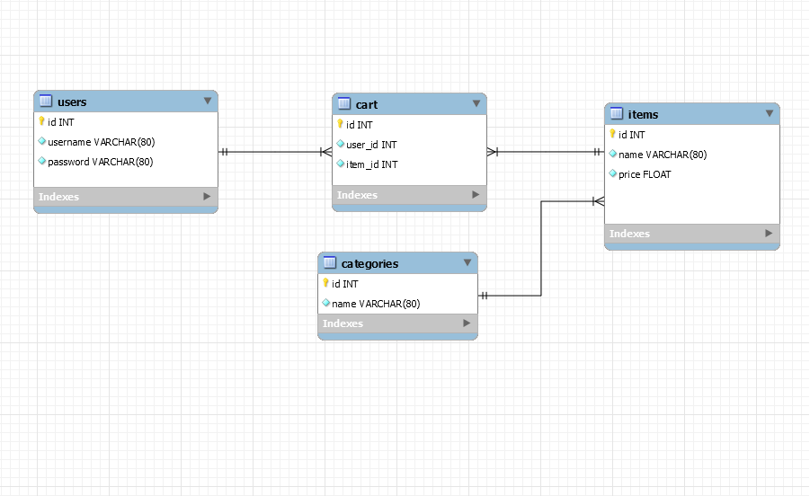

#Sklep komputerowy REST API

| Nazwisko i imię | Wydział | Kierunek | Semestr | Grupa | Rok akademicki |
| :-------------: | :-----: | :------: | :-----: | :---: | :------------: |
| Szymon Nowak    | WIMiIP  | IS       |   5     |   4   | 2020/2021      |

>Na przedmiocie Inżynieria Internetu zrealizowano projekt,
> którego celem było zaprojektowanie oraz implementacja aplikacji opartej na architekturze REST. 
> Aplikacja została napisana w języku Python w środowisku Pycharm. Sama aplikacja spełnia wymagania takie
> jak: poprawnie skonstruowany routing, baza danych z relacją, obsługa użytkowników, role użytkowników,
> routing dla określonych ról, logowanie zdarzeń.

##Projekt bazy danych
Na potrzeby projektu została stworzona prosta baza danych. Składała sie ona z relacji jeden do wielu.
Obsługa bazy danych została rozwiązana poprzez wykorzystanie biblioteki SQLAlchemy. Użycie tej biblioteki
umożliwiło łatwiejsze tworzenie tabel oraz odwoływanie się do odpowiednich encji. Do stworzenia bazy
wykorzystano SQLite, lecz dzięki wykorzystaniu SQLAlchemy możemy w łatwy sposób zmienić wykorzystywany
system zarządzania relacyjnymi bazami danych.



##REST API

* **Wykorzystane URL w programie**
```buildoutcfg
api.add_resource(UserRegister, '/register')
api.add_resource(User, '/user/<int:user_id>')
api.add_resource(UserLogin, '/login')
api.add_resource(UserLogout, '/logout')
api.add_resource(TokenRefresh, '/refresh')
api.add_resource(CategoryList, '/categories')
api.add_resource(Category, '/category/<string:name>')
api.add_resource(Item, '/item/<string:name>')
api.add_resource(ItemList, '/items')
api.add_resource(Cart, '/cart/<int:item_id>')
api.add_resource(UserCart, '/user/cart')
```

* **Wykorzystane metody w programie**
    
    `GET`|`POST`|`DELETE`|`PUT`
  

* **Przykłady wykorzystania metod**
  
    ###**GET REQUEST**

        `GET item/<item_name>`

    **DATA PARAMS EXAMPLE**
    
        NONE

    **RESPONSE**

        Content-Type: application/json
        Content-Length:85
        Status: 200 OK
        Date:Tue, 26 Jan 2021 23:25:38 GMT
        {"id": 27, "name": "Cyberpunk", "price": 197.13, "category_id": 9}

    ###**POST REQUEST**

        `POST /item/<item_name>`
    
    **DATA PARAMS EXAMPLE**
    
        {"price": 17.99, "category_id": 3}

    **RESPONSE**

        Content-Type: application/json
        Content-Length:79
        Status: 201 CREATED
        Date:Tue, 26 Jan 2021 23:41:21 GMT
        {"id": 29, "name": "item", "price": 17.99, "category_id": 3}

    ###**PUT REQUEST**

        `PUT /item/<item_name>`
    
    **DATA PARAMS EXAMPLE**
    
        {"price": 3299.00, "category_id": 1}

    **RESPONSE**

        Content-Type: application/json
        Content-Length:80
        Status: 200 OK
        Date:Tue, 26 Jan 2021 23:52:42 GMT
        {"id": 28, "name": "item", "price": 3299.0, "category_id": 3}

    ###**DELETE REQUEST**

        `POST /item/<item_name>`
    
    **DATA PARAMS EXAMPLE**
    
        NONE

    **RESPONSE**

        Content-Type: application/json
        Content-Length:34
        Status: 200 OK
        Date:Tue, 26 Jan 2021 23:44:38 GMT
        {"message": "Item deleted"}
    